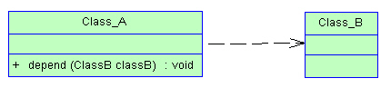

# oo  

## 故事
最近遇到一老板，要求写文档，俺写得很正式，技术解决方案，系统架构设计，面向对象等等。可是老板看了一直说“你这不对。。看不懂啊。。”  

我挺郁闷，老板经常说一些专业术语，可是术语归术语，起初你会听着很亲切，觉得遇到一个懂专业的老板，可是几轮沟通下来你就会发现，你快要丢失自己的世界观了——老板很强硬，自己认为是什么就是什么，专业术语用得不要不要的，可是他说的词汇是专业术语词汇，意思确是千差万别...  

后来俺发现正确认识术语还是很重要，所以想开始起草这个项目。OO就是我们常说的Object Oriented。  

## 这个事情怎么开始呢  

俺不是写书出版，还是按照老套路边写边梳理吧，就是想到哪写到哪，回顾哪块知识就写哪，偶尔也抄一把。  

## 类/对象之间的关系  

网上各个文章有的说有三个关系，有的说有5个关系。咱们相对搞全面一点。  
一般来说我们分为：继承/泛化、实现、依赖、关联、聚合、组合。

### 继承/泛化  

继承指的是一个类（称为子类、子接口）继承另外的一个类（称为父类、父接口）的功能，并可以增加它自己的新功能的能力。在Java中继承关系通过关键字extends明确标识，在设计时一般没有争议性。在UML类图设计中，继承用一条带空心三角箭头的实线表示，从子类指向父类，或者子接口指向父接口。 

### 实现  

实现指的是一个class类实现interface接口（可以是多个）的功能，实现是类与接口之间最常见的关系。在Java中此类关系通过关键字implements明确标识，在设计时一般没有争议性。在UML类图设计中，实现用一条带空心三角箭头的虚线表示，从类指向实现的接口。 

### 依赖  

简单的理解，依赖就是一个类A使用到了另一个类B，而这种使用关系是具有偶然性的、临时性的、非常弱的，但是类B的变化会影响到类A。比如某人要过河，需要借用一条船，此时人与船之间的关系就是依赖。表现在代码层面，为类B作为参数被类A在某个method方法中使用。在UML类图设计中，依赖关系用由类A指向类B的带箭头虚线表示。  

### 关联  

关联体现的是两个类之间语义级别的一种强依赖关系，比如我和我的朋友，这种关系比依赖更强、不存在依赖关系的偶然性、关系也不是临时性的，一般是长期性的，而且双方的关系一般是平等的。关联可以是单向、双向的。表现在代码层面，为被关联类B以类的属性形式出现在关联类A中，也可能是关联类A引用了一个类型为被关联类B的全局变量。在UML类图设计中，关联关系用由关联类A指向被关联类B的带箭头实线表示，在关联的两端可以标注关联双方的角色和多重性标记。  

### 聚合  

聚合是关联关系的一种特例，它体现的是整体与部分的关系，即has-a的关系。此时整体与部分之间是可分离的，它们可以具有各自的生命周期，部分可以属于多个整体对象，也可以为多个整体对象共享。比如计算机与CPU、公司与员工的关系等，比如一个航母编队包括海空母舰、驱护舰艇、舰载飞机及核动力攻击潜艇等。表现在代码层面，和关联关系是一致的，只能从语义级别来区分。在UML类图设计中，聚合关系以空心菱形加实线箭头表示。  

### 组合  

组合也是关联关系的一种特例，它体现的是一种contains-a的关系，这种关系比聚合更强，也称为强聚合。它同样体现整体与部分间的关系，但此时整体与部分是不可分的，整体的生命周期结束也就意味着部分的生命周期结束，比如人和人的大脑。表现在代码层面，和关联关系是一致的，只能从语义级别来区分。在UML类图设计中，组合关系以实心菱形加实线箭头表示。  

### 总结     

对于继承、实现这两种关系没多少疑问，它们体现的是一种类和类、或者类与接口间的纵向关系。其他的四种关系体现的是类和类、或者类与接口间的引用、横向关系，是比较难区分的，有很多事物间的关系要想准确定位是很难的。前面也提到，这四种关系都是语义级别的，所以从代码层面并不能完全区分各种关系，但总的来说，后几种关系所表现的强弱程度依次为：组合>聚合>关联>依赖。  

